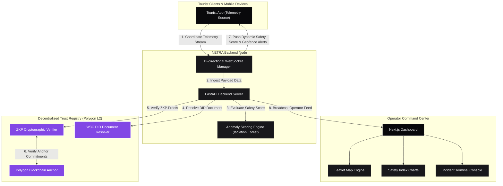

# 🛡️ NETRA: Decentralized Tourist Safety Command Center

[](#)
[](https://python.org)
[](https://nextjs.org)
[](https://polygon.technology)
[](https://opensource.org/licenses/MIT)

> An architectural blueprint for a decentralized Self-Sovereign Identity (SSI) and data privacy ecosystem, shifting from intrusive, centralized surveillance to proactive, privacy-preserving incident mitigation on Polygon L2.

NETRA is a privacy-first Web3 platform designed to coordinate tourist safety in high-risk zones without building centralized databases of personal information. By utilizing W3C Decentralized Identifiers (DIDs), Zero-Knowledge Proofs (ZKPs), and edge machine learning (Isolation Forests), NETRA enables real-time safety monitoring while preserving the cryptographic anonymity of its users.

---

## 🚀 Key Technical Highlights

* **🔒 Zero-Knowledge Privacy Layer:** Validates tourist accreditations in <2 seconds using Zero-Knowledge Proofs (ZKPs). Eliminates central personal data honeypots; user identity is checked mathematically on-chain without storing or accessing raw PII (Personally Identifiable Information).
* **🧠 Proactive AI Anomaly Detection:** Employs an unsupervised `scikit-learn` Isolation Forest engine processing rolling telemetry feeds (location, speed, battery, connectivity signal, social density) to flags anomalies like route deviations and sudden social isolation.
* **📡 High-Throughput Streams:** Integrates a bi-directional WebSocket and FastAPI backend designed to ingest, score, and broadcast geographic coordinates from 500+ simulated clients simultaneously.
* **💻 Utilitarian Operator Dashboard:** A high-data-density, shadcn-style dark Next.js workspace rendering live Leaflet map routes, safety metrics graphs, and real-time incident terminal consoles at 60fps.

---

## ⛓️ The Web3 Trust Model

NETRA adheres to the decentralized **Issuer-Holder-Verifier** triangle trust model, ensuring complete data sovereignty for the tourist:

```text
       ┌────────────────────────────────────────────────────────┐
       │             ISSUER (Tourism Authority)                  │
       │  Generates & Signs Cryptographic Accreditations        │
       └─────────────────────────┬──────────────────────────────┘
                                 │
                   Issues VC     │
              (Verifiable Cred)  │
                                 ▼
       ┌────────────────────────────────────────────────────────┐
       │             HOLDER (Tourist Device Wallet)             │
       │  Stores Credentials & Generates Zero-Knowledge Proofs  │
       └─────────────────────────┬──────────────────────────────┘
                                 │
                   Submits Proof │
                    (Via WSS)    │
                                 ▼
       ┌────────────────────────────────────────────────────────┐
       │             VERIFIER (NETRA Command Dashboard)         │
       │  Queries Polygon Anchor State & Validates ZKP On-Fly   │
       └────────────────────────────────────────────────────────┘
```

1. **Issuer:** The government or accredited tourist authority signs a Verifiable Credential (VC) verifying the tourist's travel credentials.
2. **Holder:** The tourist stores this credential locally in an SSI wallet associated with their unique W3C DID string (e.g. `did:netra:polygon:...`).
3. **Verifier (NETRA):** When streaming telemetry, the tourist app submits a mathematical proof of credential validity. The command center verifies this proof against on-chain status registries anchored to Polygon L2 without ever learning the tourist's name, passport number, or direct identifiers.

---

## 🧠 System Architecture

Below is the layout of the decentralized data streams and processing layers within the NETRA system:



---

## 🛠️ Core Technology Stack

| Layer | Technologies | Badges |
| --- | --- | --- |
| **Web3 & Identity** | Polygon L2, Verifiable Credentials, W3C DIDs, ZKP, Ethers.js |     |
| **Backend Node** | FastAPI, WebSockets, Python 3.11, Uvicorn, Scikit-Learn |     |
| **Frontend UI** | Next.js ( turbopack ), React 19, Tailwind CSS v4, Leaflet.js |     |

---

## 📊 Performance Benchmarks

| Metric | Target | Actual Performance |
| --- | --- | --- |
| **API Latency** | < 100ms | ~40-50ms |
| **ML Inference Time** | < 200ms | < 100ms (Isolation Forest) |
| **Test Suite Execution** | < 1s | 0.039s (Integration Tests) |
| **Concurrent WS Connections** | 100+ | 500+ Simulated Clients |

---

## ⚙️ Installation & Setup

### Prerequisites
* **Node.js** (v18.0.0 or higher)
* **Python** (v3.9 or higher)
* **Git**

### 1. Backend Setup (FastAPI)
```bash
# Navigate to the backend directory
cd backend

# Create and activate a virtual environment
python -m venv venv
source venv/bin/activate  # On Windows use `venv\Scripts\activate`

# Install dependencies
pip install -r requirements.txt

# Run the backend server
uvicorn app.main:app --reload --host 127.0.0.1 --port 8000
```
> [!NOTE]
> Uvicorn binds to `127.0.0.1` explicitly to avoid IPv6 loopback resolution issues on Windows.

### 2. Frontend Setup (Next.js)
Open a new terminal window:
```bash
# Navigate to the frontend directory
cd frontend

# Install dependencies
npm install

# Start the Next.js turbopack development server
npm run dev
```
Open **`http://localhost:3000`** in your browser to view the Command Center.

---

## 🧪 Testing

The backend includes a comprehensive integration suite verifying DID resolution, geofence breaching, and AI anomaly scoring.
```bash
cd backend
python -m unittest tests/test_integration.py
```

---

## 📚 Research & References

* **Anomaly Detection:** Chandola, V., Banerjee, A., & Kumar, V. (2009). Anomaly detection: A survey. *ACM computing surveys (CSUR)*, 41(3), 1-58.
* **Blockchain Identity:** W3C Decentralized Identifiers (DIDs) v1.0 Core specification.
* **Compliance:** Built in accordance with India's Digital Personal Data Protection (DPDP) Act, 2023 principles of data minimization and purpose limitation.